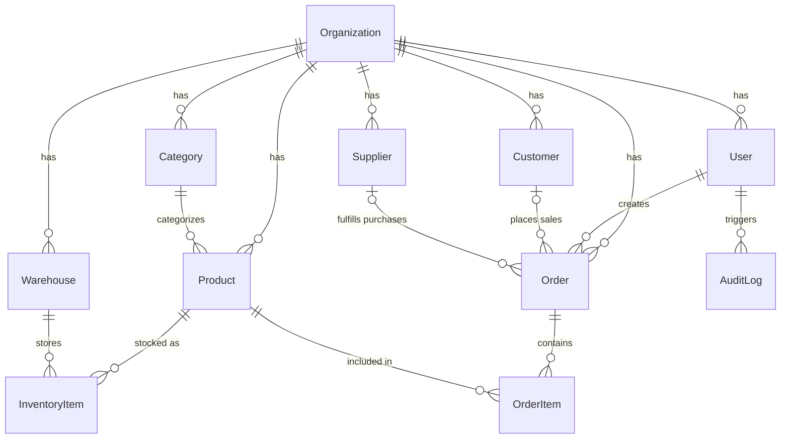
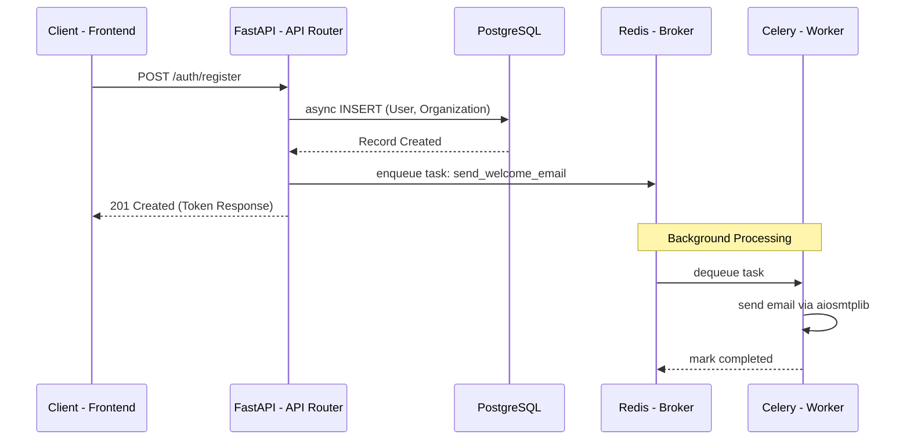

# System Architecture

This document provides a high-level overview of the StockPilot backend architecture, data model, and future technical roadmap.

## Entity-Relationship Diagram (ERD)

The core database is designed around a strict multi-tenant model. Almost all entities are heavily partitioned by `org_id` to ensure absolute data isolation between different client organizations.

> [!NOTE]
> **Soft Deletion Strategy**
> Critical entities (`Product`, `Customer`, `Supplier`, `Warehouse`) implement an `is_active` boolean rather than allowing hard deletes. This preserves relational integrity so that historical orders and invoices referencing those entities do not crash or lose context when an item is removed from the active catalog.

## Application Architecture & Data Flow

To ensure the FastAPI event loop is never blocked by long-running operations (like generating PDF reports or sending emails), I utilize an asynchronous message broker pattern.

### Key Technical Choices
- **`asyncpg` Engine:** I use the `asyncpg` driver for SQLAlchemy instead of the traditional synchronous `psycopg2`. This allows high-concurrency connection pooling, crucial for handling simultaneous POS transactions.
- **Pydantic Validation:** All incoming and outgoing data passes through strict Pydantic schemas, preventing injection attacks and ensuring type safety at the API boundary.

## Future Roadmap & Areas for Improvement

While the current architecture is robust and production-ready, enterprise systems are never truly "finished." Below is a prioritized roadmap of technical improvements I plan to implement to scale the system further.

### 1. Automated Testing Strategy (CI/CD)
**Goal:** Implement automated quality gates before any deployment.
- Setup GitHub Actions to run `pytest` and `flake8` on every Pull Request.
- Create an ephemeral test database within the CI runner to execute integration tests against all API endpoints.

### 2. Real-Time WebSockets
**Goal:** Prevent race conditions in inventory management.
- If two employees in the same Organization are managing inventory, they should see stock levels update instantly without refreshing.
- Implement FastAPI WebSockets connected to a Redis Pub/Sub channel (partitioned by `org_id`) to broadcast inventory changes to all active client sessions.

### 3. API Rate Limiting
**Goal:** Protect against DDoS and brute-force attacks.
- Utilize my existing Redis cache to implement IP-based and User-based rate limiting (e.g., maximum 10 login attempts per minute, 100 API requests per minute).

### 4. Advanced Auditing (Event Sourcing)
**Goal:** Perfect traceability for accounting purposes.
- The current `AuditLog` table records basic actions. Moving forward, I intend to implement full Event Sourcing for the `InventoryItem` table, meaning the current stock level is calculated by aggregating all historical +/- adjustments, rather than just updating a single integer.
